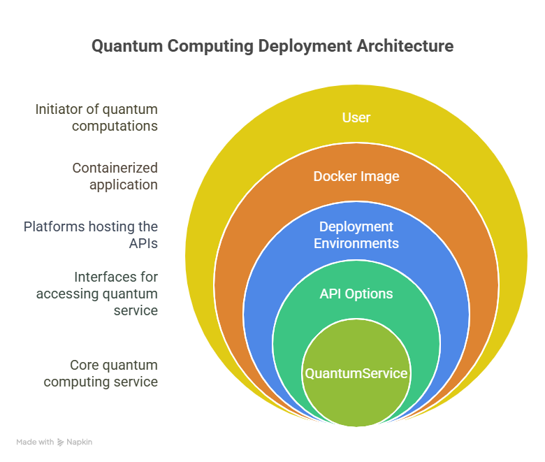
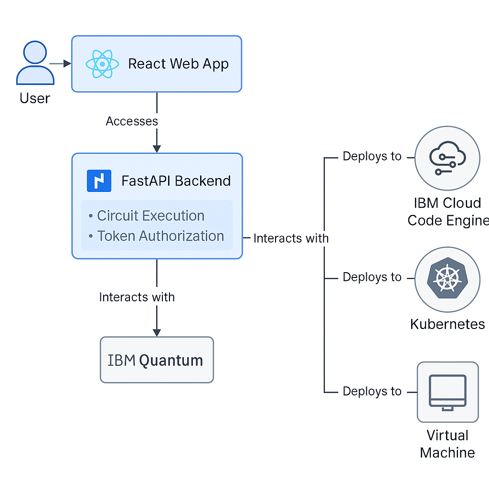
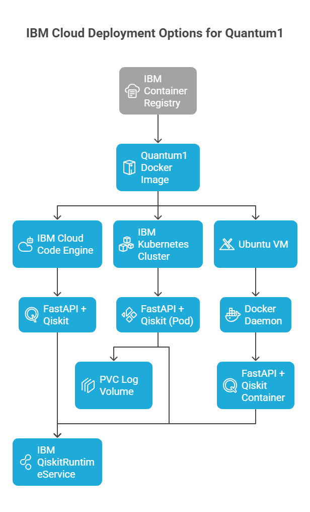

# Qiskit 1.0 Project
# Quantum1: FastAPI + Qiskit API on IBM Cloud

This project provides a full-stack template to build, containerize, and deploy a Qiskit-based API using FastAPI, Docker, and IBM Cloud Code Engine.

---

## 🚀 Project Objective

Build a Python FastAPI application that executes quantum circuits via Qiskit SDK, dockerize the application, and deploy it seamlessly on IBM Cloud Code Engine using GitHub Actions and CLI automation.
## 🖥️ Development Environment Overview


---
## 🖼️ Deployment Architecture


----

## 🧰 Prerequisites

### 1. Operating System

* Windows 11 (Home or Pro)

### 2. Accounts & Access

* ✅ GitHub account + Repository: [accelcq/quantum1](https://github.com/accelcq/quantum1)
* ✅ IBM Cloud account with billing enabled: [https://cloud.ibm.com](https://cloud.ibm.com)

  * Create IBM Cloud API Key
  * Enable: `IAM → Manage → Access → API Keys`
  * Create resource group (e.g., `quantum-group`)
  * Create a container registry namespace (e.g., `accelcq`) in `us-south`
  * Create Code Engine project (e.g., `quantum1-project`)
* ✅ IBM Quantum Token: [https://quantum.ibm.com](https://quantum.ibm.com)

### 3. Software Installation

Install the following on your local machine:

| Tool          | Description / Link                                                                                    |
| ------------- | ----------------------------------------------------------------------------------------------------- |
| Docker        | [Install Docker Desktop](https://www.docker.com/products/docker-desktop/)                             |
| Git           | [Install Git](https://git-scm.com/downloads)                                                          |
| Python 3.11   | [Python 3.11.9](https://www.python.org/ftp/python/3.11.9/python-3.11.9-amd64.exe) <br> ✅ Add to PATH! |
| VS Code       | [Download VS Code](https://code.visualstudio.com/)                                                    |
| IBM Cloud CLI | [Install CLI](https://github.com/IBM-Cloud/ibm-cloud-cli-release)                                     |
| Pyenv-win     | [pyenv-win](https://github.com/pyenv-win/pyenv-win) (optional)                                        |

### 4. VS Code Extensions (Manual Installation)

Install via Extensions panel:

* Docker
* Python (by Microsoft)
* Pylance
* GitHub Copilot + Copilot Chat
* GitHub Actions
* IBM Cloud CLI + IBM Cloud Account
* Q by QuLearnLabs
* OpenQASM – Qiskit Debugger

---

## 🛠️ Local Development Environment Setup

1. Clone setup helper:

   ```bash
   git clone https://github.com/ranjantx/qiskit_windows_setup
   ```
2. Use VENV from `C:\Users\<USERNAME>\Envs\Qiskit\qiskit_100_py311`
3. Activate the VENV:

   ```bash
   C:\Users\<UserName>\Envs\Qiskit\qiskit_100_py311\Scripts\activate
   ```
4. Open folder in VS Code: `C:\Users\<UserName>\Projects\Qiskit\qiskit_100_py311`
5. Set interpreter: `Ctrl+Shift+P → Python: Select Interpreter → qiskit_100_py311`
6. Install project dependencies:

   ```bash
   pip install -r requirements.txt
   ```
7. Terminal should show: `(qiskit_100_py311)` in VS Code

⏱️ **Note:** The entire dev setup process realistically takes 20–30 minutes including account registration, tool installations, and quantum environment setup. The 10-minute estimate assumes tools are preinstalled and keys/tokens already provisioned.

---

## 📁 Project Layout (Quantum1)

```
quantum1/
├── .github/workflows/deploy.yml       # CI/CD workflow
├── .vscode/tasks.json                 # VS Code task to deploy locally
├── app/main.py                        # FastAPI + Qiskit API with JWT, quantum backend access, logging
├── frontend/src/App.js                # React frontend with login, token storage, API integration
├── frontend/package.json              # React config for axios, react-scripts, etc.
├── Dockerfile                         # Multi-stage build for FastAPI + React
├── deploy.sh                          # CLI automation script for IBM Code Engine
├── deploy.yaml                        # YAML config to deploy as a Code Engine app
├── requirements.txt                   # Python deps: Qiskit, FastAPI, auth, etc.
├── .env.local                         # Secrets (ignored by git)
├── .gitignore                         # Excludes venv, .env, etc.
├── README.md                          # Project documentation
```

---

## 📦 Python Dependencies (`requirements.txt`)

```text
qiskit==1.0.0
qiskit-ibm-provider>=0.7.0
qiskit-ibm-runtime>=0.23.0
qiskit-machine-learning>=0.7.0
numpy>=1.21.0
fastapi>=0.70.0
uvicorn[standard]>=0.17.0
python-dotenv
python-jose[cryptography]
passlib[bcrypt]
pydantic>=1.8.0
```

---

## 🐳 Docker Setup

### `Dockerfile`
(See in repo with inline comments)

### `.vscode/tasks.json`

```json
{
  "version": "2.0.0",
  "tasks": [
    {
      "label": "Deploy Qiskit API to IBM Code Engine",
      "type": "shell",
      "command": "./deploy.sh",
      "options": {
        "envFile": "${workspaceFolder}/env.local"
      },
      "presentation": {
        "reveal": "always",
        "panel": "shared"
      },
      "problemMatcher": []
    }
  ]
}
```

---

## 🔐 Local Secrets (`.env.local`)

```dotenv
IBM_CLOUD_API_KEY="<Paste your API Key>"
IBM_CLOUD_REGION="us-south"
IBM_QUANTUM_API_URL="https://api.quantum-computing.ibm.com/api"
IBM_QUANTUM_API_TOKEN="<Paste your Quantum Token>"
```

---

## 🚀 Deploy

### 🗂️ Push Local Project to GitHub

```bash
cd C:\Users\<UserName>\Projects\Qiskit\qiskit_100_py311
git init
git remote add origin https://github.com/<yourgithubreponame>/quantum1.git
git add .
git commit -m "Initial commit"
git branch -M main
git push -u origin main
```
### 📄 More Deployment Options

For additional deployment strategies and a comparison to help you choose the best approach, see [DeploymentOptions.md](./DeploymentOptions.md).
## 🏗️ Deployment Architecture Options


### ☁️ IBM Cloud Code Engine Deployment

```bash
./deploy.sh
```

This will:
- Login to IBM Cloud
- Create Code Engine project if not exists
- Create secret `quantum1-secrets`
- Build + push image to IBM Container Registry
- Apply app deployment

---
## 🏢 Kubernetes & Compute VM Deployment Options

For advanced deployment scenarios, including Kubernetes clusters (IBM Cloud Kubernetes Service, OpenShift) and Compute VM (IBM Virtual Server), see [Quantum_K8S_And_ComputeVM_options.md](./Quantum_K8S_And_ComputeVM_options.md).

This document covers:

- Helm chart setup for Qiskit API
- IBM Cloud Kubernetes Service (IKS) deployment steps
- OpenShift deployment notes
- VM provisioning and Docker Compose
- Security, scaling, and cost considerations

Refer to it if you need more control, custom networking, or hybrid/multi-cloud quantum workloads.
---
## 🧪 Run and Test

### ▶️ Local FastAPI Test

```bash
uvicorn app.main:app --reload --port 8000
```
- Access Swagger: http://localhost:8000/docs
- Use `/token` to authenticate with username/password
- Test protected `/run-circuit` and `/logs` endpoints with JWT

### ▶️ Local React Frontend Test

```bash
cd frontend
npm install
npm start
```
- Open: http://localhost:3000
- Login using: `accelcq` / `password123`
- Run circuit and fetch logs securely

### ☁️ Cloud Test

```bash
ibmcloud ce application get --name quantum1 --output url
```
- Open deployed URL and test `/docs` or React UI if bundled
- Verify login, execution, and JWT-secured circuit results

---

## ⏱️ Approximate Time Estimates

| Step                                            | Time Taken |
| ----------------------------------------------- | ---------- |
| GitHub account + repo setup                     | 5–10 min   |
| IBM Cloud setup (billing, IAM, Code Engine)     | 30–60 min  |
| Software install (Docker, Git, Python, VS Code) | 10–15 min  |
| Clone + activate VENV                           | 1 min      |
| VS Code interpreter config                      | 1 min      |
| `pip install -r requirements.txt`               | 3 min      |
| Local run test (`uvicorn`, `/docs`)             | <1 min     |
| React setup (`npm install`, `npm start`)        | 3 min      |
| Docker build + push                             | 2–3 min    |
| Deploy to Code Engine                           | 2–3 min    |
| GitHub Action full CI/CD (if used)              | 4–5 min    |

---

For issues or help, open an issue on GitHub or join Qiskit Slack or Contact ranjan@accelcq.com for more information.
